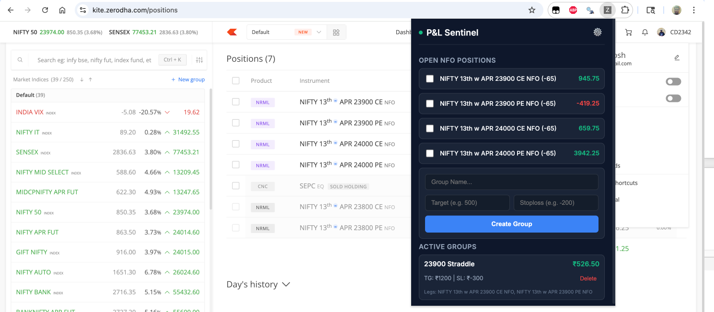
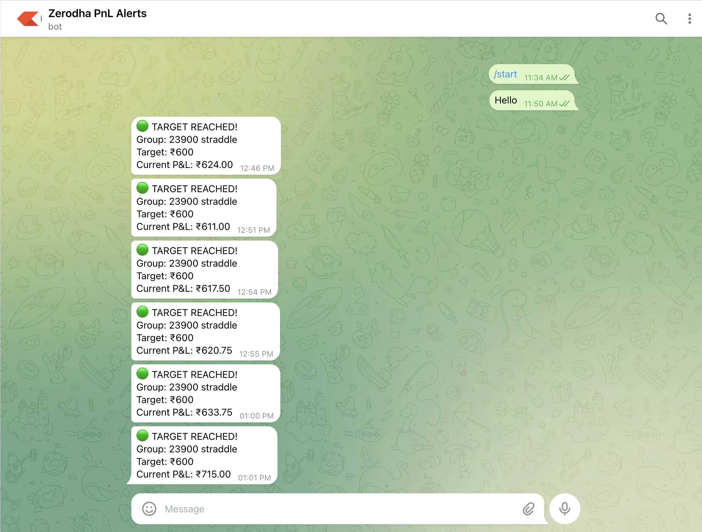

# 🚀 Zerodha P&L Sentinel

> ⚡ Local-first Chrome extension that tracks your Kite positions and sends **real-time Telegram alerts** when your custom thresholds are breached.

---

## 📸 Screenshots

| Dashboard View | Telegram Alert Example |
|:---:|:---:|
|  |  |

## 🎥 Demo Video

Watch the extension demo here: [YouTube Demo](https://youtu.be/3IOdcy1gvI0)

---

## 🧠 How It Works

- Runs entirely in your browser (no external servers to pass sensitive data to)
- Scrapes Kite Positions page locally
- Allows creating user-defined "Groups" from active positions
- Monitors real-time Net P&L for these specific groups
- Sends instant Telegram messages based on your exact Target and Stoploss figures.

---

## 📦 Installation

⚠️ This is a custom, private browser extension. You must install it manually.

1. Open Chrome and navigate to the extensions page:
   ```
   chrome://extensions/
   ```
2. Enable **Developer mode** via the toggle switch in the top-right corner.
3. Click the **"Load unpacked"** button in the top-left area.
4. Select the location of this directory:
   `/Users/.../zerodha-extension/`
5. Pin the extension for quick visibility:
   *Click the Puzzle 🧩 icon in the Chrome toolbar → Click the 📌 Pin icon next to "Zerodha P&L Sentinel"*

---

## 🚀 Usage Guide

### 1. Configure Telegram
- Open the extension by clicking its icon.
- Go to **Settings ⚙️**.
- Enter your **Bot Token** and **Chat ID**.
- Click **Save**.

### 2. Prepare Kite Workspace
Open the positions page and keep it active during market hours:
```
https://kite.zerodha.com/positions
```
> **❗ IMPORTANT:** The tab must stay open, as the script needs to dynamically read the web page DOM. Do not minimize the window or let your system sleep.

---

### 3. Create Monitoring Groups
- In the open popup, you will see a list of open FnO positions.
- Use the checkboxes to select legs belonging to a single strategy (e.g., matching CE and PE).
- Define group parameters:
  - **Group Name:** A memorable alias (e.g., 'BankNifty Straddle').
  - **Target:** A profit target where an alert is desired (e.g., 1000).
  - **Stoploss:** A stop limit target where an alert is desired (e.g., -500).
- Click **Create Group**.

---

### 4. Alerts
Alerts automatically trigger and post to your configured Telegram bot when:
- Combined Net P&L ≥ Target
- Combined Net P&L ≤ Stoploss

**Key Features:**
- **Cooldown Throttle**: To prevent Telegram spam, a single group will not fire another alert for *5 minutes* after triggering.
- **Auto-Close detection**: If the total net quantity of your group positions is `0` (i.e. you have squared off the trades), it halts alerts for that group.

---

## ⚠️ Disclaimer

- This extension depends inherently on Zerodha Kite's Document Object Model (HTML classes, hierarchy, etc.). Updates deployed by Zerodha may potentially break functionality unexpectedly.
- This codebase **does not** execute trades. It serves strictly as a monitoring notification service.
- **Not financial advice. Use responsibly** Ensure your device is secure.
